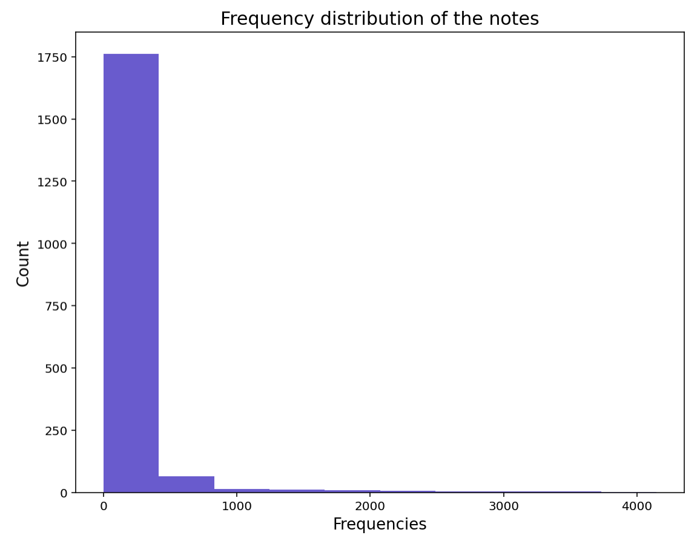
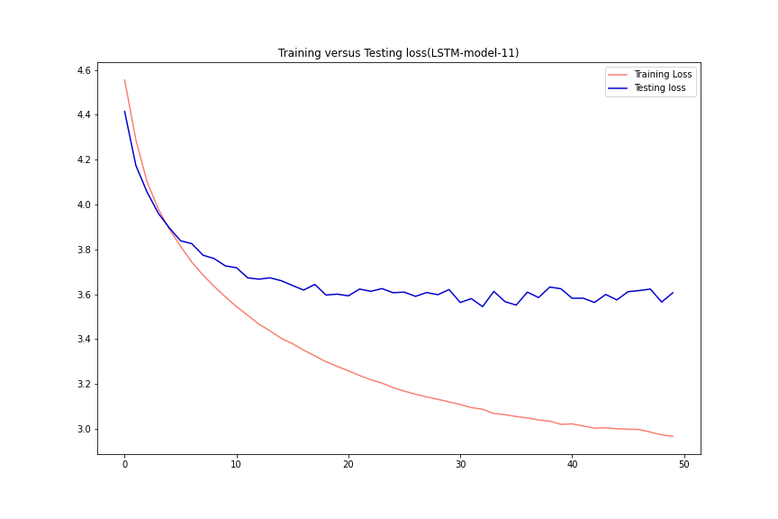

# Music Generation via Machine Learning Project

## Executive Summary

## Problem statement
As a data scientist for a Record Company that utilizes music samples, personnel in accounting are worried about the exponentially increasing expenses with clearing samples for artists beats. They are wondering if a model can generate new music from existing jazz and classical works.  In order to have a bigger collection from which to sample from in house, we can then scale up and create sounds with other genres.  This could really help the finances of the business as we could be decreasing those expenditures that result in clearing samples. We can define success in part by the objective measure of minimizing value loss when creating these models.  Another factor to take into account is how this music is perceived and we can use some objective criteria for that as well such as rhythm, or patterns of notes that sound dynamic.

## Background research

### Music
The art of music concerns itself with combining sonic frequencies usually from conventional instruments in order to achieve beauty of form and/or emotional expression which are in accordance with certain standards proposed by their culture. There are disagreements as to the subject of the origin of music.  Mainly around whether it coincided before, after, or during the origin of language.  While we cannot be sure of its origin, there is no denying its significance as a cultural pillar across the history of mankind.  
### Music Theory
Music is often studied through the lens of mathematics. For example, any string instruments will vibrate at particular frequencies.  With regard to music theory, discrete whole numbers have long been suited for labeling the pitches or keys of the piano.  Music theory was also helpful to legendary composers like Bach, Mozart, and Beethoven; in that it supplied the composer with a framework for pattern recognition, which went a long way to making sense of the notes in order to commit them to memory.  These principles of mapping sounds to discrete numbers along with pattern recognition are part of what makes it possible to generate music through machine learning.  
### Pitch
Pitch is the perceptual property of sounds that allows their ordering on a frequency related scale, it allows for us to judge how "high" or "low" a sound is within a musical melody.  
Humans tend to recognize relative relationships, not absolute physical values. And when we do, those relationships (especially in the aural domain) tend to be logarithmic. That is, we don’t perceive the difference (subtraction) of two frequencies, but rather the ratio (division).

### Musical notes
In music, a note is a symbol denoting a musical sound.  Notes can represent the pitch and duration of a sound in musical notation.  Notes can be thought of as the building blocks for written music, and help with its comprehension and analysis.

## Software Requirements
* Numpy
* Matplotlib
* Sklearn
* Keras
* Music21
* MuseScore3(In conjunctin with Music21,enables the notes to be displayed in musical sheet format)

### Music21
The project uses the music21 library in order to help parse out the notes in the data set.  It is also a useful library in order to do EDA around musical concepts such as the distribution of frequencies, and the proportionality as to which a note is used within a given measure.  

## Description of Dataset

The dataset is comprised of midi files scraped from https://bushgrafts.com/midi/.  These midi files are of the jazz genre, while 301 files were scraped some of them need to be reformatted in order to go through the processing via the music 21 library. This leaves 214 midi jazz files to work with.  Additionally, the dataset also includes 295 classical music midi files that were found on kaggle here, https://www.kaggle.com/soumikrakshit/classical-music-midi.  Along with this there are 400 other piano midi files that were supplied for this project.

## Data Visualizations & Analysis

### Distribution of notes by Frequency

This is the first of a few visualizations which show how big the disparity there is for low frequency notes versus higher frequency notes.  Although this only includes 47 classical works, we will see this shift when we add in more songs.  

When adding more songs you can see that the frequency of the notes is supremely concentrated at <500hz.  You have very low presences of frequencies all the way to about the 4250hz mark.  

Even bigger sampling of about 300 songs only further increases the disparity of the histogram.  

### Histogram of pitches & Key Analysis

First the series of distributions looks at individual songs that are part of the MIDI collection.  We can get some inference from this in that Mozart uses A and D notes primarily, while Beethoven used G, C and E flat. On the other hand Brahms used G, C, and D with a more even distribution while Chopin used C, D and E.  You can also see a count difference which would make sense as the composers may have used different tempos and textures to their music.  

The Krumhansl-Schmuckler Key Finding algorithm is a key finding model in which the distribution of pitch classes in a piece is compared to an ideal distribution for that key.  The plots here are used more for inferential purposes, as this key finding algorithm can generalize to a major key versus its flat or sharp counterparts. Nonetheless, it does have a good success rate in terms of grouping keys and giving a visual as to whether a major or minor key was struck and how prominent it is throughout a given measure.  
These plots show the presence of keys across the first 20 measures of the particular work(will not match up with the first histogram directly).  These plots give you a different way to get inference than that of the histogram.  For example with Beethoven's Opus we see C minor heavily represented as opposed to C major which we cannot necessarily infer from the histogram.  For Mozart's Opus he opens the composition with A and D minor dominating the first 20 measures.  These works would give off different sentiments since minor chords are generally perceived as less bright and more somber than their major chord counterparts.  

## Finding the right model

Upon researching this project it seems that some of the best methodologies for generating new music is by using the music21 library.  In music21 we can parse through notes, process the data and assign each note a unique integer. This then allows us to prepare input and output sequences that we can feed neural networks.  

This project uses a CNN model of wave net architecture and iterates through some parameters to see if we can minimize for loss. The model uses convolutional layers and it does well with sequential data. The convolutional layers include dilation that increase the receptive field of a model, while preserving the output shape of the input. This type of model trained a lot faster than those that used LSTM layers.  

The alternative type of model is a RNN model with two LSTM layers that will be iterated through as well.  This type of model also captures the sequential information present in the input sequence, but takes a lot longer to train.

Being that I am interested in having a model that works well but that will not produce a carbon copy of notes from the original works.  With that said these models aim to rely on val_loss in order to prevent overfitting.  We want to achieve the delicate balance between overfitting and minimizing errors in the model.

### CNN Wavenet  Modeling

This modeling attempt has a value of the loss function is 3.04633. The architecture of the model involves 3 1D convolutional layers along with 1D pooling layers as well. There are also dropout layers that are set at 0.2.  This first test model also included 47 classical songs.

This next iteration of the model includes about 100 classical compositions.  Adds an additional convolutional and pooling layer.  The following adjustments were made; increased dropout to 0.4, decreased batch size to 64.  Adjusted the Adam optimizer learning rate to .0005.  This lead to a worsened value of the loss function of 3.69174.

This iteration adjusts the learning rate for adam to .0009.  The dropout is also lowered to 0.3, since overfitting does not seem to be an issue.  The value of the loss function is 3.60457.

Model 4 included a reduction of dropout to .2, and a change in how the layers are stacked by having the filter value start high and then descend. An increase in parameters seems to lead to a better value of the loss function:3.20868.

This version decreases dropouts to varying degrees for the first 2 layers.  Learning rate is decreased to .0007, the results are not too different from the previous model at 3.21.

### LSTM RNN Modeling
.png "1st LSTM Model")
Start off with 2 LSTM layers with units of 128 and then 64, the value of the loss function 3.69540. The value of the loss function really remains steady after about 10 epochs.

The lstm units are doubled at each layer to 256 and 128.  The value of the loss function is 3.61182 but there is still the issue of the value loss staying constant after about the first 10 epochs.

This iteration includes another increase in LSTM units to 512 and 256, as well as adding a Dense layer and increasing the Dense layers as well. The learning rate for adam was adjusted to .0009 and the batch size was decreased to 32.  This lead to a value of the loss function for 3.64972, which is not too different from the previous model.

This model adds dropout layers of 0.25, increases the adam learning rate to .002, and increases the batch size to 48, the value of the loss function suffers and increases to 4.48162.

After both models had the dropout implemented, the loss got worse, therefore the dropout rate was reduced to .05.  The adam learning rate was increased to .005 and it resulted in an even worse value of the loss function of 4.7361.

In order to increase the parameters both LSTM layers were increased to 512 units.  Since overfitting has not been an issue the dropout was reduced to .01, and the Adam learning rate was reduced to .001.  This resulted in the best performing LSTM model and had the value of the loss function decrease to 3.54461.  

|         Model         |         Val_loss         |
|:---------------------:|:------------------------:|
|       Wavenet I       |          3.04633         |
|       Wavenet II      |          3.69174         |
|      Wavenet III      |          3.60457         |
|       Wavenet IV      |          3.20868         |
|       Wavenet V       |           3.21           |
|         LSTM I        |          3.69540         |
|        LSTM II        |          3.61182         |
|        LSTM III       |          3.64972         |
|        LSTM IV        |          4.48162         |
|         LSTM V        |          4.7361          |
|        LSTM VI        |          3.54461         |

## Too underfit

### 1000 Epochs

Something to notice about val loss, this is a similar architecture to model 11, although with a larger data set of about 500 midi files.  This model is training across 1000 epochs, and one could argue could have simply been trained across 200 as loss and val_loss do no necessarily improve.  The other side of the coin here is that the model does seem to start overfitting overtime. Another factor to consider is the music generated by this model is one of the better ones.  The val loss of this model was 4.20970.

### More Midis

Introduced additional midi songs in order to try and solve the underfitting issue.  This indicates about 1000 midi songs. That is about 1.4 million notes, and 1231 unique notes. At this stage I am using the best architectures from both LSTM and Wavenet batches from the previous iterations and comparing them. I wanted to compare the LSTM with the Wavenet models to see which model had a better performance with the same amount of data.

This uses the architecture for model 11, in order to see if the model's success would scale with the added data.  While I was aiming to get the model to stop being under-fit, this new model is actually over fit.  The val_losses have also increased in baseline as more data gets added.  The Val loss here is 4.04647.

Same idea here, using similar architecture to model 5.  Once again the trend remains where all the additional data has now made the model very overfit.  This val loss is 3.8230 which is lower than the LSTM.  

Due to the overfitting I increased the dropout rate to .25 for each layer. However this model was still overfit and its val_loss kept increasing.  Research indicates that the learning rate could be too high, so a future iteration of this model would have to have a lower learning rate and a higher dropout rate.  

## Conclusions & Recommendations.

My methodology involved iterating through different wavenet and LSTM models in order to try and generate musical notes.  From this initial round of iterations the best performing models were the 4th Wavenet model as it has the lowest  val_loss at 3.20 followed by the 5th wavenet model at 3.21. If we are to select a good LSTM model from this round of iteration, then we can select the 6th LSTM model that had a val loss of 3.54461.  Interestingly these particular models also generated more dynamic notes and rhythms and show the potential of music generation.
From here we tried solving the under-fitting issue, although some under-fitting was fine as we did not want to simply reproduce the compositions.  We attempted an LSTM model with 1000 epochs, but that became overfit.  Also iterated through the aforementioned Wavenet and LSTM models that performed well in the first round.  Those were also overfit when introduced to more data. When hearing the compositions that these models come up with, there is a bit of a monotone quality to the composition.  At this moment in time you could not use these pieces as a basis or foundation for other works.
This is a mixed bag of performance, but when you hear some of the music generated you can see the potential that this has.

The potential highlights:
* music4.midi
* music5.midi
* music6.midi
* music7.midi
* music8.midi
* music11.midi

### Next steps

Would love access to more useable data.  Would need to clean up the midi files themselves as some of them have track layers with no data.  It would be a matter of removing the excess layers for these additional songs.  Tried some midi software but was unable to either save the subsequent file as midi or the software had no functionality to view these layers.  Additionally the LSTM model could benefit from an encoder and decoder layer which could potentially improve performance of the model.  Or another approach could be combining a larger dataset with over 1000 epochs and an increased dropout.  That can be a fun part of iterating through these models, as they can be tinkered with endlessly.  

## References

### Music

*  http://davidtemperley.com/wp-content/uploads/2015/11/temperley-mp99.pdf
* http://extras.humdrum.org/man/keycor/
* https://en.wikipedia.org/wiki/Musical_note
* https://web.mit.edu/music21/doc/about/what.html
* http://musicandcomputersbook.com/
* https://www.britannica.com/art/music

### Neural networks

* https://www.analyticsvidhya.com/blog/2017/12/fundamentals-of-deep-learning-introduction-to-lstm/#h2_1

* https://www.analyticsvidhya.com/blog/2020/01/how-to-perform-automatic-music-generation/

* https://stats.stackexchange.com/questions/326065/cross-entropy-vs-sparse-cross-entropy-when-to-use-one-over-the-other

* https://stackoverflow.com/questions/63073760/using-dilated-convolution-in-keras

* https://stackoverflow.com/questions/47299624/how-to-understand-loss-acc-val-loss-val-acc-in-keras-model-fitting/47303461

* https://machinelearningmastery.com/loss-and-loss-functions-for-training-deep-learning-neural-networks/

* https://web.mit.edu/music21/doc/index.html

* https://towardsdatascience.com/pyzzicato-piano-instrumental-music-generation-using-deep-neural-networks-ed9e89320bf6
