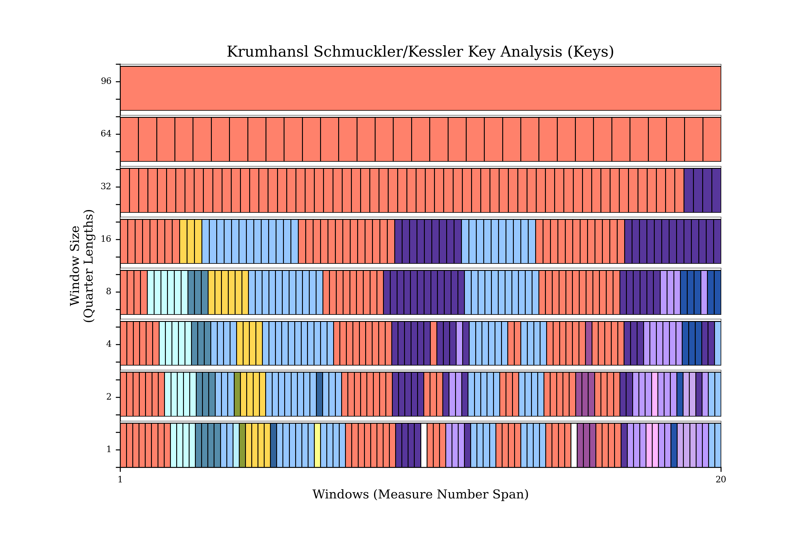

#  Capstone - Music Generation via Machine Learning

## Executive Summary

## Problem statement
Work as a data scientist for a manager of artists that depend on music sample backdrops.  The manager is worried about the exponentially increasing expenses with clearing samples for his artists beats. If a model can generate new music from existing jazz works to have a bigger collection from which to sample from in house, we can scale up and create sounds with other genres.  This could really help the finances of the business by decreasing the reliance of those expenditures.  Could even be used to inspire artists in house to aid in creating organic sounds.  

## Background research

### Music
The art of music concerns itself with combining sonic frequencies usually from conventional instruments in order to achieve beauty of form and/or emotional expression which are in accordance with certain standards proposed by their culture. There are disagreements as to the subject of the origin of music.  Mainly around whether it coincided before, after, or during the origin of language.  While we cannot be sure of its origin, there is no denying its significance as a cultural pillar across the history of mankind.  
### Music Theory
Music is often studied through the lens of mathematics. For example, any string instruments will vibrate at particular frequencies.  With regard to music theory, discrete whole numbers have long been suited for labeling the pitches or keys of the piano.  Music theory was also helpful to legendary composers like Bach, Mozart, and Beethoven; in that it supplied the composer with a framework for pattern recognition, which went a long way to making sense of the notes in order to commit them to memory.  These principles of mapping sounds to discrete numbers along with pattern recognition are part of what makes it possible to generate music through machine learning.  
### Pitch
Pitch is the perceptual property of sounds that allows their ordering on a frequency related scale, it allows for us to judge how "high" or "low" a sound is within a musical melody.  
Humans tend to recognize relative relationships, not absolute physical values. And when we do, those relationships (especially in the aural domain) tend to be logarithmic. That is, we don’t perceive the difference (subtraction) of two frequencies, but rather the ratio (division).

### Musical notes
In music, a note is a symbol denoting a musical sound.  Notes can represent the pitch and duration of a sound in musical notation.  Notes can be thought of as the building blocks for written music, and help with its comprehension and analysis.

## Software Requirements
* Numpy
* Matplotlib
* Sklearn
* Keras
* Music21
* MuseScore3

### Music21
The project uses the music21 library in order to help parse out the notes in the data set.  It is also a useful library in order to do EDA around musical concepts such as the distribution of frequencies, and the proportionality as to which a note is used within a given measure.  

## MuseScore 3 enables

## Description of Dataset

The dataset is comprised of midi files scraped from https://bushgrafts.com/midi/.  These midi files are of the jazz genre, while 301 files were scraped some of them need to be reformatted in order to go through the processing via the music 21 library. The dataset also includes 295 classical music midi files that were found on kaggle here, https://www.kaggle.com/soumikrakshit/classical-music-midi.

## Finding the right model

Upon researching this project it seems that some of the best methodologies for generating new music is by using the music21 library.  In music21 we can parse through notes, process the data and assign each note a unique integer. This then allows us to prepare input and output sequences that we can feed neural networks.  This project uses a CNN model of wave net architecture and iterates through some parameters to see if we can minimize for loss. The alternative type of model is a RNN model with two LSTM layers that will be iterated through as well.  

## Data Visualizations & Analysis

Taking advantage of music21  

This is the first of a few visualizations which show how big the disparity there is for low frequency notes versus higher frequency notes.  Although this only includes 47 classical works, we will see this shift when we add in more songs.  

### Distribution of notes by Frequency

When adding more songs you can see that the frequency of the notes is supremely concentrated at <500hz.  You have very low presences of frequencies all the way to about the 4250hz mark.  

Even bigger sampling of about 300 songs only further increases the disparity of the histogram.  

### Histogram of pitches & Key Analysis

First the series of distributions looks at individual songs that are part of the MIDI collection.  We can get some inference from this in that Mozart uses A and D notes primarily, while Beethoven used G, C and E flat. On the other hand Brahms used G, C, and D with a more even distribution while Chopin used C, D and E.  You can also see a count difference which would make sense as the composers may have used different tempos and textures to their music.  

## Conclusions & Recommendations.
